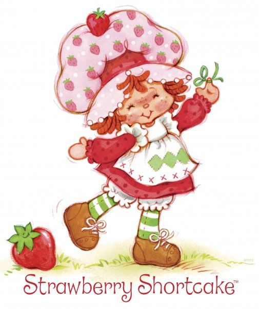
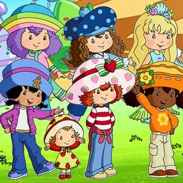

<!-- comment -->

# heading 1
## heading 2
### heading 3
#### heading 4
##### heading 5

<!-- text italics -->

Text in *italics*

<!-- text in bold-->

Text in **bold**
Text in __bold__

<!-- text crossed -->

Text is `highlighted` and ~~crossed~~

<!--tool tip , URL -->

[Texto](http://google.com "Tooltip tet")

<!-- images -->





<!--text block-->
```txt
one two three 
```

<!-- python-->

``` python 
print("Hello world!") 
```

<!-- JavaScript -->
```javascript
console.log('hello world!')
const test = ()
```

<!-- html-->
```html
<h1>Hello World!</h1>
```

<!-- quotes -->
> this is a note

<!-- horizontal text div>
---
***
___

<!-- Mentions -->
@sofiavsbubbles :+1: :smile:

<!-- table -->
| one | two | three |
| - | - | - |
| ichi | ni |san|
|uno|dos|tres|

<!-- tareas -->
* [x] uno
* [ ] dosdos
* [x] dos
* [ ] dosdosdos
* [x] tres